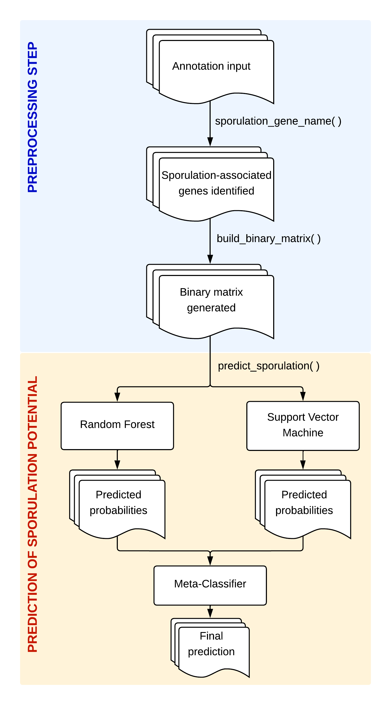

# Probability of Sporulation potential in MAGs (SpoMAG) 


## Scope

<p align="center">

</p>

SpoMAG is an R-based machine learning tool developed to predict the sporulation potential of Metagenome-Assembled Genomes (MAGs) from uncultivated Firmicutes species, particularly from the Bacilli and Clostridia classes. The premise behind SpoMAG is that the complex combination of presence or absence of sporulation-associated genes across a genome can be leveraged to infer its potential to form spores, even in the absence of cultivation or complete genome assemblies. This strategy enables researchers to investigate spore-forming potential in metagenomic studies using only genomic annotations.

Below we present the SpoMAG's workflow. It begins with the preprocessing step regarding two functions. The first, `sporulation_gene_name()`, parses a functional annotation table, such as those generated by eggNOG-mapper, and identifies gene hits relevant to sporulation using a curated list of gene names and KEGG orthologs. The function requires as input a data frame containing the `Preferred_name` and `KEGG_ko` columns and returns a filtered table of annotations containing sporulation-related genes. The second function in the pipeline, `build_binary_matrix()`, converts the filtered annotations into a binary matrix where each row represents a genome and each column a gene, with values of 1 or 0 indicating presence or absence, respectively. This function automatically adds missing genes as zero-filled columns, ensuring compatibility with the machine learning models. Finally, binary matrix is directed to the prediction of sporulation potential step, comprising the `predict_sporulation()` function, which applies a trained ensemble model that consists of Random Forest and Support Vector Machine models combined into a stacked meta-classifier.

<p align="center">

</p>


What makes SpoMAG especially accessible is that it abstracts away the complexity of machine learning. Users only need to provide the raw annotation table, and SpoMAG handles gene filtering, matrix construction, and model application in a fully automated manner. This simplicity allows researchers without prior bioinformatics or machine learning expertise to apply the tool to novel genomes.

SpoMAG's predictive framework is based on an ensemble learning approach. It combines the predictions from two independently trained models, Random Forest and Support Vector Machine, each trained on high-quality labeled datasets of known spore-formers and non-spore-formers. The predictions are then used as features in a meta-classifier using model stacking, enhancing prediction accuracy and allowing SpoMAG to capture complementary decision boundaries from each model.

SpoMAG outputs a comprehensive prediction report that includes the classification label (Sporulating or Non-sporulating), the individual probabilities from the RF and SVM models, and the final ensemble probability from the stacked meta-model. This layered prediction enhances interpretability and provides confidence scores for downstream biological interpretation.
SpoMAG’s models were trained using stratified cross-validation and optimized to avoid overfitting. Performance was evaluated using stardard metrics such as AUC-ROC, F1-score, Accuracy, precision, specificity and recall. As a result, SpoMAG delivers high sensitivity and specificity across MAGs recovered from different hosts' microbiota.

Whether you're working with hundreds of MAGs from microbiome studies or investigating a single novel lineage of interest, SpoMAG provides a scientifically rigorous and automated solution to infer sporulation potential. It does not require the need for cultivation, phenotypic validation, or labor-intensive manual annotation, offering a practical tool to explore the ecological and functional roles of spore-forming bacteria in complex microbial communities.

The repository for SpoMAG is at GitHub on the https://github.com/labinfo-lncc/SpoMAG. In this website you can report a bug and get help.


## Citation

Paper under publication.


## Installation of the SpoMAG package

You can install the **SpoMAG** package directly from GitHub using:

```r
# Install devtools if not already installed
install.packages("devtools")

# Install SpoMAG from GitHub
devtools::install_github("labinfo-lncc-br/SpoMAG")
```

### Dependencies

SpoMAG depends on the following packages:

- dplyr, version XXX
- tidyr, version XXX
- tibble, version XXX
- readr, version XXX
- caret, version XXX
- randomForest, version XXX


### Preprocessing functions in SpoMAG

### 1. `sporulation_gene_name()`
It extracts sporulation-related genes from an annotation dataframe by searching for gene names and KEGG orthologs.
- Input: A dataframe with Preferred_name and KEGG_ko columns.
  
- Output: A filtered dataframe containing only sporulation-related hits, each annotated with a standardized column consensus_name_this_study.
  

```r
genes <- sporulation_gene_name(df)
```

### 2. `build_binary_matrix()`
It creates a binary matrix indicating the presence (1) or absence (0) of known sporulation genes in each genome.
- Input: A dataframe output from sporulation_gene_name().
  
- Output: A wide-format dataframe (1 row per genome, 1 column per gene).
   

```r
matrix <- build_binary_matrix(genes)
```

Note: The function automatically fills in missing genes with 0 to ensure consistent input for prediction.

### Function to predict sporulation using SpoMAG

### 3. `predict_sporulation()`
It applies a pre-trained ensemble machine learning model (Random Forest + SVM) to predict the sporulation potential of genomes based on the binary matrix of genes.

- Input:

  binary_matrix: Output from build_binary_matrix()

  model_path: Path to .RData file.
  
- Output: A dataframe with:
  
  Meta_Prediction: Final prediction (Esporulante or Nao_Esporulante)
  
  Meta_Prob_Esporulante: Ensemble probability of being a spore-former
  

```r
results <- predict_sporulation(binary_matrix = matrix, model_path = "path/to/modelos_stacking2.RData")
```

### Input data format

To use SpoMAG, your input must be a functional annotation table, such as the output from eggNOG-mapper, containing at least two columns:

| Preferred_name | KEGG_ko |
|----------------|---------|
| ftsZ           | K02304  |
| spo0A          | K07699  |
| ...            | ...     |


- Preferred_name: the predicted name of the gene
- KEGG_ko: the KEGG Orthology code (e.g., K07699)

Each row should represent one gene annotation.

## Quick start
### Running with a single genome in the annotation file
This is a quick example using the included files one_sporulation.csv (a known spore-former) and one_asporogenic.csv (a known non-spore-former).
The genome used for the spore-former here is the following:

- XXXX (speciesXXXX, Clostridia class)

  
The genome used for the non-spore-former here is the following:

- XXXX (speciesXXXX, Clostridia class)


```r
# Load package
library(SpoMAG)

# Load example annotation tables
file_spor <- system.file("extdata", "sporulation.csv", package = "SpoMAG")
file_aspo <- system.file("extdata", "asporogenic.csv", package = "SpoMAG")

# Read files
df_spor <- readr::read_csv(file_spor)
df_aspo <- readr::read_csv(file_aspo)

# Step 1: Extract sporulation-related genes
genes_spor <- sporulation_gene_name(df_spor)
genes_aspo <- sporulation_gene_name(df_aspo)

# Step 2: Convert to binary matrix
bin_spor <- build_binary_matrix(genes_spor)
bin_aspo <- build_binary_matrix(genes_aspo)

# Step 3: Predict using ensemble model (preloaded in package)
model_path <- system.file("extdata", "modelos_stacking2.RData", package = "SpoMAG")

result_spor <- predict_sporulation(bin_spor, model_path)
result_aspo <- predict_sporulation(bin_aspo, model_path)

# View results
print(result_spor)
print(result_aspo)
```

The output includes the following columns:
- Meta_Prediction: final ensemble prediction
- Meta_Prob_Esporulante: predicted probability of being a spore-former


### Running with more than one genome in the annotation file
This is a quick example using the included files ten_sporulation.csv (ten known spore-formers) and ten_asporogenic.csv (ten known non-spore-formers).
The genomes used for the spore-formers here are the following:

- XXXX (speciesXXXX, Bacilli class)
- XXXX (speciesXXXX, Bacilli class)
- XXXX (speciesXXXX, Bacilli class)
- XXXX (speciesXXXX, Bacilli class)
- XXXX (speciesXXXX, Bacilli class)
- XXXX (speciesXXXX, Clostridia class)
- XXXX (speciesXXXX, Clostridia class)
- XXXX (speciesXXXX, Clostridia class)
- XXXX (speciesXXXX, Clostridia class)
- XXXX (speciesXXXX, Clostridia class)
  
The genomes used for the non-spore-formers here are the following:

- XXXX (speciesXXXX, Bacilli class)
- XXXX (speciesXXXX, Bacilli class)
- XXXX (speciesXXXX, Bacilli class)
- XXXX (speciesXXXX, Bacilli class)
- XXXX (speciesXXXX, Bacilli class)
- XXXX (speciesXXXX, Clostridia class)
- XXXX (speciesXXXX, Clostridia class)
- XXXX (speciesXXXX, Clostridia class)
- XXXX (speciesXXXX, Clostridia class)
- XXXX (speciesXXXX, Clostridia class)


```r
# Load package
library(SpoMAG)

# Load example annotation tables
file_spor <- system.file("extdata", "sporulation.csv", package = "SpoMAG")
file_aspo <- system.file("extdata", "asporogenic.csv", package = "SpoMAG")

# Read files
df_spor <- readr::read_csv(file_spor)
df_aspo <- readr::read_csv(file_aspo)

# Step 1: Extract sporulation-related genes
genes_spor <- sporulation_gene_name(df_spor)
genes_aspo <- sporulation_gene_name(df_aspo)

# Step 2: Convert to binary matrix
bin_spor <- build_binary_matrix(genes_spor)
bin_aspo <- build_binary_matrix(genes_aspo)

# Step 3: Predict using ensemble model (preloaded in package)
model_path <- system.file("extdata", "modelos_stacking2.RData", package = "SpoMAG")

result_spor <- predict_sporulation(bin_spor, model_path)
result_aspo <- predict_sporulation(bin_aspo, model_path)

# View results
print(result_spor)
print(result_aspo)
```

The output includes the following columns:
- Meta_Prediction: final ensemble prediction
- Meta_Prob_Esporulante: predicted probability of being a spore-former


